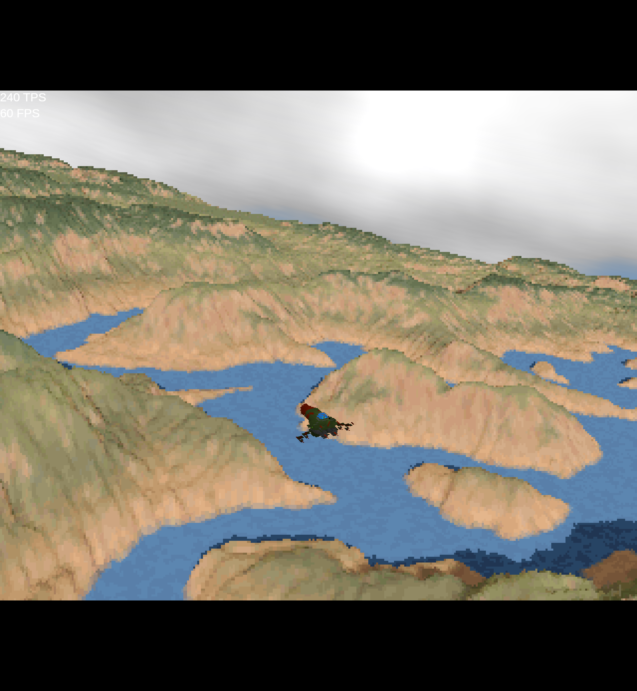

# Mini Voxels

A Flutter Flame Game Demo

Experimenting with old-school voxel rendering via shader.

Primary credit goes to: https://github.com/s-macke/VoxelSpace

And of course the original inventors of voxel rendering back in the 90s:

https://en.wikipedia.org/wiki/Comanche_(video_game_series)

### NON-Playable Web Version

https://intensicode.github.io/mini_voxels/

### Screenshots

